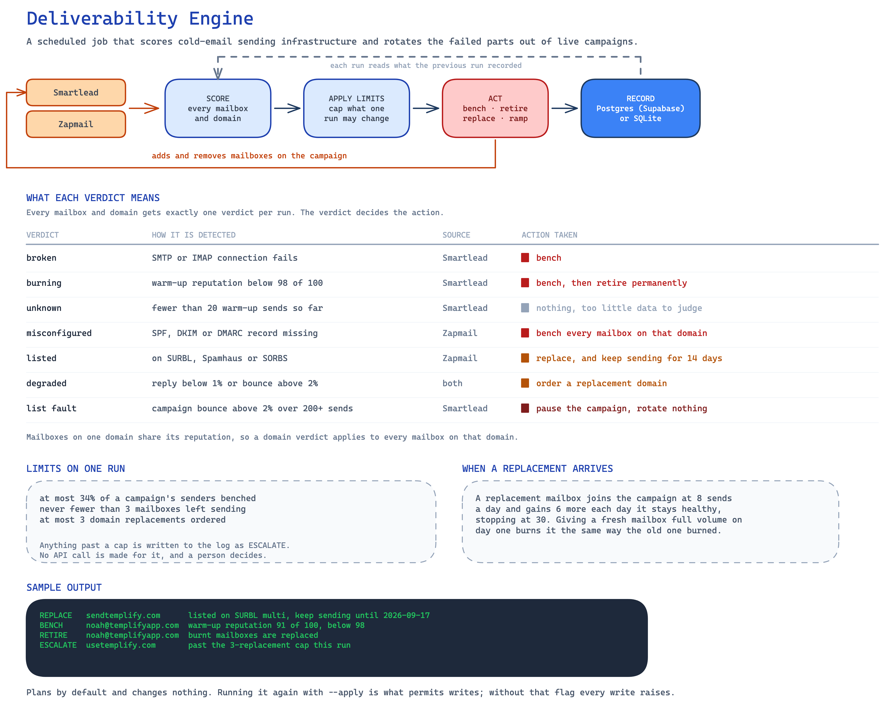

# Deliverability Engine

Monitors cold-email sending infrastructure, benches what is burnt, and rotates
in what is warm. Runs on a schedule, decides on its own, and reports what it
did and why.

## Architecture



[Download the editable Excalidraw diagram](docs/architecture.excalidraw) and
open it in [Excalidraw](https://excalidraw.com).

It reads two systems because neither sees the whole picture:

- **Smartlead** knows how a mailbox is *performing* — warm-up reputation,
  reply rate, bounce rate.
- **Zapmail** knows what the domain underneath it *is* — SPF, DKIM, DMARC,
  nameserver reputation, and blacklist listings.

A domain listed on SURBL keeps posting acceptable Smartlead numbers for a
while before the reply rate falls off. That gap is the window worth acting in,
and only the second system can see it.

## What it decides

Three layers, because they describe different faults with different remedies.

| Layer | Signal | Fault | Remedy |
|---|---|---|---|
| Mailbox | Warm-up reputation below 98% | This inbox is burnt | Bench, then retire |
| Mailbox | SMTP or IMAP disconnected | Cannot send at all | Bench |
| Domain | Missing SPF/DKIM/DMARC | Every send is unauthenticated | Bench the whole domain now |
| Domain | Listed on SURBL/Spamhaus/SORBS | Reputation will not recover | Warm a replacement, keep sending, retire in 14 days |
| Domain | Reply rate under 1%, bounce over 2%, or worst decile | Degrading | Order a replacement |
| Campaign | Bounce rate over 2% | The **list** is bad, not the infrastructure | Pause. Rotate nothing. |

Thresholds come from Growth Engine X's published operating rules, with the
EmailBison additions where they fire earlier. Every one lives in
[`config.yaml`](config.yaml) with its source in a comment, so disagreeing with
a number is a text edit rather than a code change.

Two decisions in that table are deliberately counterintuitive:

**A blacklisted domain is not pulled.** A listing costs roughly 30% of reply
rate, not all of it. Pulling it before a replacement is warm removes capacity
you have not replaced yet, so it keeps sending while its successor warms and
is retired on a date the plan states.

**A bounce spike stops rotation entirely.** High bounces mean the list is
bad. Rotating fresh domains into a bad list burns the fresh domains too, so
the engine pauses the campaign and asks for a human instead of spending money
making the problem worse.

## Guardrails

It can pull mailboxes out of live campaigns, so it is built to fear its own
false positives:

- **Plan by default.** Nothing mutates without `--apply`. The API clients
  themselves raise on any write when the run is a plan, so a bug in the
  calling code still cannot change production.
- **Blast radius.** No run removes more than 34% of a campaign's senders.
  Wanting more is evidence of a systemic fault, which is escalated, not acted
  on.
- **Floor.** A campaign never drops below three sending mailboxes.
- **Bounded spend.** At most three domain replacements per run, terminal
  faults ordered first.
- **Insurance check.** Benching without a warm replacement is capacity loss,
  so a thin reserve is reported before it becomes a surprise.
- **No guessing.** A mailbox with too little warm-up traffic reads `unknown`
  rather than being condemned on noise. Where per-domain rates are inferred
  from campaign totals rather than measured, they are reported and never used
  to condemn a domain.
- **Open tracking is never enabled.** GEX measured lower reply rates on days
  it was on.

## Quickstart

```bash
pip install requests pyyaml
cp .env.example .env      # fill in SMARTLEAD_API_KEY and ZAPMAIL_API_KEY

python3 run.py --offline  # full decision path against fixtures, no network
python3 run.py --check    # verify credentials and API paths
python3 run.py            # plan against live data, change nothing
python3 run.py --apply    # execute
```

`--offline` runs the same scoring and policy code as a live run against
[`tests/fixtures`](tests/fixtures); only the transport differs.

Scheduled, with a Slack digest on each run:

```cron
0 13 * * 1-5  cd /path/to/deliverability-engine && python3 run.py --apply >> run.log 2>&1
```

## State

Supabase or any Postgres when `DATABASE_URL` is set, SQLite otherwise. Same
code path either way; [`sql/schema.sql`](sql/schema.sql) is the schema for
both.

History is the point. One reputation reading is noise; the same mailbox
sliding across four runs is a decision. Storing every reading is also what
enforces rest periods and makes reruns idempotent.

| Table | Holds |
|---|---|
| `runs` | One row per execution, plan or apply |
| `mailbox_health` | Every per-mailbox reading, with the verdict and its reasons |
| `domain_health` | Every per-domain reading: score, DNS, listings |
| `actions` | Every decision, executed or not, with its reason |
| `mailbox_state` | Current disposition, rest periods, bench counts |

Because planned actions are stored alongside applied ones, a dry run and a
live run produce comparable audit trails.

## Layout

```
run.py              orchestration and CLI
engine/config.py    policy from config.yaml, secrets from the environment
engine/smartlead.py Smartlead client, with endpoint provenance documented
engine/zapmail.py   Zapmail client: inventory, health, export to Smartlead
engine/health.py    readings -> verdicts        (pure)
engine/policy.py    verdicts -> a plan          (pure)
engine/actions.py   executes a plan, records everything
engine/store.py     Postgres/Supabase or SQLite
```

Scoring and policy perform no I/O, which is why the guardrails are testable
against fixtures without touching either API:

```bash
python3 -m pytest tests/ -q     # 16 passed
```

## Rotation path

Replacements move between platforms without this program ever handling a
mailbox password:

1. Zapmail exports warm mailboxes into Smartlead through its native
   integration, using the credential Zapmail already stores.
2. The engine matches the new accounts by address in Smartlead.
3. Each is set to the ramp-start daily volume, then added to the campaign.
4. Volume climbs each clean day toward the target. A warm mailbox given full
   volume on day one burns the way the one it replaced did.

## Known limits

- **Smartlead's per-account statistics route is not in its published index.**
  The client attempts it and falls back to apportioning campaign totals by
  sending share. The fallback is labelled `estimated` and the policy will not
  condemn a domain on it — reputation, DNS, and blacklist signals still
  decide. Verify with `--check` before trusting a live run.
- **Zapmail publishes no complete spec.** Its paths live in `config.yaml` and
  `--check` probes each one. A moved path would otherwise return an empty
  domain list, which reads as "everything is healthy" — the most dangerous
  failure this program could have.
- Reply rate is attributed to the sending mailbox, so a domain needs traffic
  before its rate means anything. `min_sends_for_rates` sets that bar.
